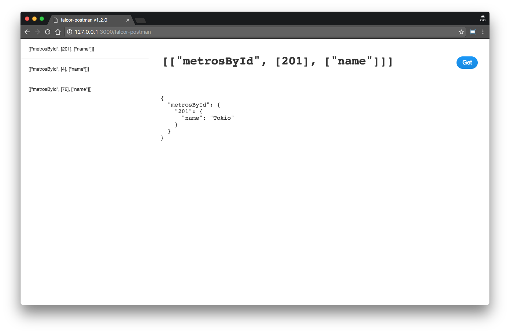

# falcor-postman

A tool that enables you to exercise your Express.js app Falcor's endpoint and therefore helps you to validate your queries.

## Usage

Npm install using the following command:

```
npm i -S falcor-postman
```

And use it inside your Express app:

```javascript
const falcorPostman = require('falcor-postman');

const app = express();

const options = { middlewarePath: '/falcor-postman', falcorPath: '/model.json', app };

app.use(falcorPostman(options));
```

Where **options** is an object with the following properties:

name|type|description|example
---|---|---|---|---
middlewarePath|_string_|Optional: path used to serve the falcor-postman app|'/falcor-postman'|
falcorPath|_string_|Optional: falcor model path|'/model.json'|
app|_object_|The instance of your Express.js app|app

## UI



## Example

Clone or download this GitHub repository then run the example app using the following npm commands:

```
npm i

npm run start
```

> You should be able to open your browser and see the middleware running at the following URL: [http://0.0.0.0:3000/falcor-postman](http://0.0.0.0:3000/falcor-postman)
